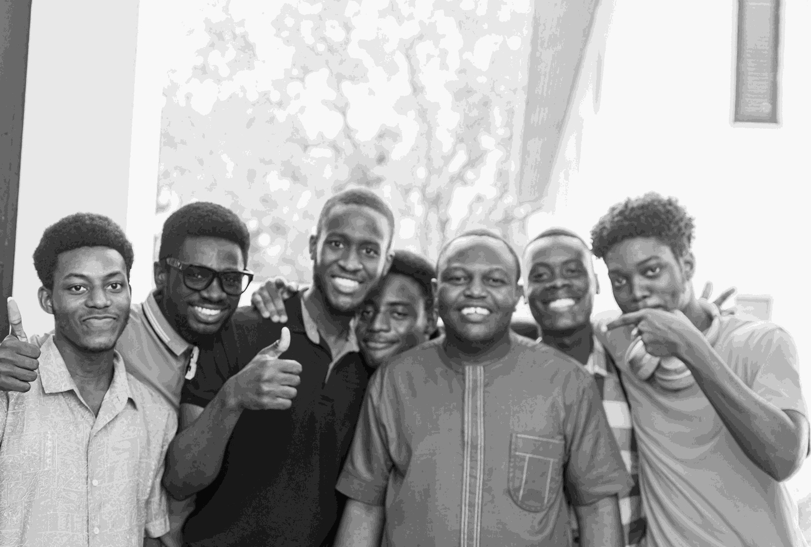

# Grayscale Run-Length Encoding (RLE) Project

This project provides a set of Python scripts to perform grayscale image Run-Length Encoding (RLE) compression and decoding. It includes scripts for converting images to and from CSV format, quantizing images, performing RLE encoding, and decoding RLE-encoded images. Additionally, scripts for visualizing images and comparing file sizes before and after compression are provided.

## Sample Images

Below are side-by-side comparisons of various images:

| Original Image | Quantized Image (16 batch) | Quantized Image (32 batch) |
|----------------|----------------------------|----------------------------|
|  |  |  |

## File Sizes Comparison

| Size         | Lossless | Lossy                 |
|--------------|----------|-----------|-----------|
|              | Original | 16 batch  | 32 batch  |
| Encoded      | 8.43 mb  | 6.41 mb   | 4.87 mb   |
| Decoded      | 6.25 mb  | 6.27 mb   | 6.27 mb   |
## Overview

The project contains the following scripts:

- `ConvertCSVToImage.py`: Converts a CSV file containing pixel values back into an image.
- `ConvertCSVToMatrix.py`: Converts a CSV file to a NumPy array.
- `ConvertImageToCSV.py`: Converts an image to a CSV file.
- `ConvertMatrixToCSV.py`: Converts a NumPy array to a CSV file.
- `PlotArray.py`: Visualizes a grayscale image.
- `QuantizationBinning16.py`: Quantizes the pixel values of an image, grouping values every 16 units.
- `QuantizationBinning32.py`: Quantizes the pixel values of an image, grouping values every 32 units.
- `RunLengthDecoding.py`: Decodes an RLE-encoded grayscale image.
- `RunLengthEncoding.py`: Encodes a grayscale image using Run-Length Encoding.

## Usage

### Encoding and Decoding

To encode an image using RLE, run `RunLengthEncoding.py`. This script takes a grayscale image as input and outputs the RLE-encoded version of the image.

```bash
python RunLengthEncoding.py
```

To decode an RLE-encoded image, run `RunLengthDecoding.py`. This script takes the RLE-encoded CSV file as input and outputs the decoded image.

```bash
python RunLengthDecoding.py
```

### Quantization

To quantize an image, run either `QuantizationBinning16.py` or `QuantizationBinning32.py`. These scripts group pixel values into bins of specified size.

```bash
python QuantizationBinning16.py
```

or

```bash
python QuantizationBinning32.py
```

### Visualization

To visualize a grayscale image, run `PlotArray.py`. This script displays the image using matplotlib.

```bash
python PlotArray.py
```

### Converting to and from CSV

- `ConvertImageToCSV.py` and `ConvertMatrixToCSV.py` are used to convert images or NumPy arrays to CSV format.
- `ConvertCSVToImage.py` and `ConvertCSVToMatrix.py` are used to convert CSV files back to images or NumPy arrays.

## Requirements

- Python 3.x
- OpenCV
- NumPy
- Matplotlib

## License

This project is licensed under the MIT License - see the [LICENSE](LICENSE) file for details.
